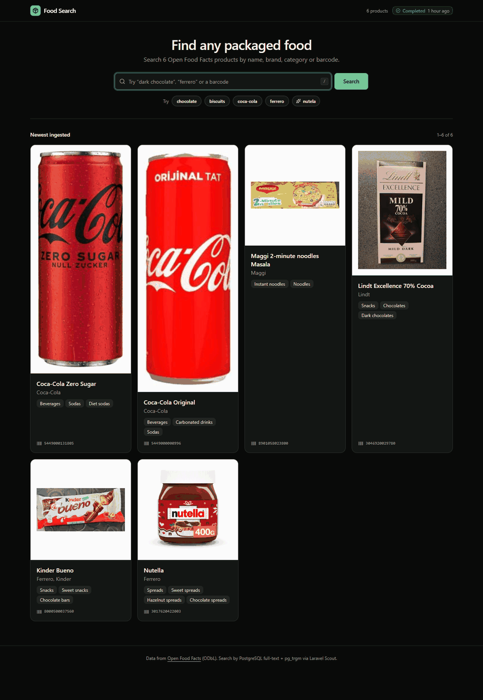

# Food Search

Laravel 13 app that ingests Open Food Facts products every week through queued jobs and serves search through **Laravel Scout's unmerged `pgsql` engine** ([laravel/scout#998](https://github.com/laravel/scout/pull/998), branch `feat/pg-native-fullsearch`).

```
schedule (Sun 02:13 IST)
  └─ foodfacts:ingest ──creates──> ingestion_runs row (cursor, cutoff)
        └─ dispatch FetchProductsPage(run, 1)            queue: ingestion
              ├─ RateLimited('openfoodfacts')  8 req/min, global
              ├─ GET /api/v2/search?page=N&sort_by=last_modified_t
              ├─ BEGIN
              │    upsert products ON CONFLICT (code)       ← Postgres recomputes search_vector
              │    ingestion_runs.next_page = N+1           ← cursor moves with the data
              │  COMMIT
              └─ stop? (exhausted | caught_up | max_pages) else dispatch page N+1

GET /?q=…  →  Product::search($q)  →  WHERE search_vector @@ websearch_to_tsquery(…)
                                        OR product_name % …   (pg_trgm, typos)
                                      ORDER BY ts_rank*1.0 + similarity*0.25
```

## Setup

```bash
composer install
cp .env.example .env && php artisan key:generate
# Postgres ≥ 12 (generated columns). pg_trgm must be creatable by the DB user (it's a trusted extension on PG 13+).
php artisan migrate

php artisan queue:work --queue=ingestion,default   # in production: Supervisor/Horizon
php artisan schedule:work                         # in production: cron `* * * * * php artisan schedule:run`

npm install && npm run build                       # or `npm run dev` while working on the UI

php artisan foodfacts:ingest --max-pages=5        # try it now
php artisan foodfacts:ingest --full               # fill the index (250 pages ≈ 25k products, ~31 min)
php artisan foodfacts:status
php artisan serve                                  # http://localhost:8000
```

Set `OFF_USER_AGENT` to your app name and a real contact email. OFF asks for it and may block anonymous-looking traffic.

### Installing the unmerged Scout PR

`composer.json` requires `"laravel/scout": "dev-feat/pg-native-fullsearch"`. The PR branch lives on `laravel/scout` itself, so Packagist already exposes it as a `dev-` version and you need no custom repository. **Pin the commit** so an upstream force-push can't change your code under you:

```json
"laravel/scout": "dev-feat/pg-native-fullsearch#0816c9acfad8afc7595ead4fe8326c998a9592f4"
```

When the PR merges, switch to the tagged release (`^11.x`). The API may change before then; the PR is still a **draft**.

## Frontend

Inertia + React + TypeScript, styled with **shadcn/ui** (new-york style, Tailwind v4). This is the same stack as Laravel's React starter kit.

- `resources/js/pages/products/search.tsx` is the search page. It has live search (a 300 ms debounce into partial Inertia visits that reload only `q` and `products`), `/` to focus the box, Esc to clear, suggestion chips and empty states.
- Results use infinite scroll. `products` is an `Inertia::scroll()` prop and the page wraps the grid in `<InfiniteScroll>`, so scrolling requests `?page=N` and Inertia appends the new rows. A new search sends `reset: ['products']` to start a fresh list. After five automatic loads it switches to a "Load more" button so the footer stays reachable. Rank ties are broken by id so pages never overlap.
- `resources/js/components/ui/*` holds the shadcn components (button, input, input-group, card, badge, separator, skeleton, spinner, kbd, empty). `components.json` is set up, so `npx shadcn@latest add dialog` works as it does in any shadcn project.
- Theme tokens are in `resources/css/app.css`. The base is neutral with a green `--primary`, and dark mode follows the OS.
- The controller sends only what the page renders (`present()`). `lastRun` and `total` are lazy props, so typing in the box doesn't re-count the table.

## Demo

This fixed-size dark-mode GIF shows a chocolate search with product photos from Open Food Facts.



## Commands

| command | what it does |
|---|---|
| `foodfacts:ingest` | Starts an incremental run, or does nothing if one is active. It resumes a stalled run from its cursor. |
| `foodfacts:ingest --full` | Ignores the watermark and pages up to `max_pages`. Runs monthly so the index keeps growing past the weekly deltas. |
| `foodfacts:ingest --max-pages=N` | Sets a per-run page cap. |
| `foodfacts:ingest --resume-only` | Runs hourly. It only revives stalled runs and never starts a new one. |
| `foodfacts:status` | Shows the last runs, their stop reasons and errors, and the index size. |

## Design decisions

**Why a self-dispatching chain rather than `Bus::batch()`?** OFF allows 10 search requests per minute per IP, so parallel page jobs gain nothing. An incremental run also doesn't know its page count up front. It stops when it reaches products older than last week's watermark, and a batch would have to pre-create jobs for pages it never needs. The chain keeps its cursor in Postgres, so any failure resumes from the exact page.

**Why is the cursor updated in the same transaction as the upsert?** It gives exactly-once effects on top of at-least-once delivery. If a worker dies after the commit, the redelivered job sees `next_page != page` and exits. If it dies before the commit, nothing was written and the page is fetched again. The upsert is idempotent on `code` either way.

**Why `retryUntil()` instead of `$tries`?** The `RateLimited` middleware *releases* jobs, and each release counts as an attempt. With `$tries = 3`, a healthy job that waited for its rate-limit slot three times would be marked failed. Wall-clock time (6h) and `$maxExceptions = 5` bound real failures instead.

**Why doesn't the HTTP client retry?** The queue already retries with backoff (30s, 2m, 5m, 10m). Retrying in both layers multiplies calls against a 10/min budget.

**How errors are classified:**
- A 429 releases the job for `Retry-After` seconds and doesn't count as an exception.
- A 5xx, a timeout, or an HTML maintenance page served with a 200 throws `RemoteUnavailable`. That error is transient and the job is retried.
- Any other 4xx throws `InvalidResponse`. The job fails immediately and the run is marked failed.

**Why doesn't Scout's `queue` setting matter here?** The pgsql engine's `update()` and `delete()` are no-ops. `search_vector` is a `GENERATED ALWAYS … STORED` column, so Postgres recomputes it on every write, including `Product::upsert()`, which fires no Eloquent events. With Algolia or Meilisearch, bulk upserts would silently skip indexing. Here they can't. The tradeoff is that the vector is recomputed on every write and you can't index derived data from other tables.

**Why are the weights A/A/B/C?** The barcode and name are weighted A, brands B and categories C. A search for "chocolate" therefore ranks *Dark Chocolate 70%* above biscuits that are only *categorised* as chocolate.

## Known limits

- **OFF's search API is not a bulk export.** OFF asks clients that need more than a few hundred products to use the daily JSONL/CSV dumps. At 8 req/min × 100 products, the default cap of 250 pages takes about 31 minutes and covers 25,000 products. The full catalogue (3M+ products) would take days. Use the API for a scoped slice (`OFF_COUNTRY`, a category filter) or for weekly deltas. For the whole database, change the job to stream the JSONL dump in chunks: the upsert path and the search stay the same.
- The incremental cutoff assumes `sort_by=last_modified_t` returns products newest-first. If OFF changes that ordering, runs fall back to `max_pages` and stay correct, just slower.
- **Typo matching only works on short names.** The PR's trigram branch uses `product_name % ?`, which compares the query with the *whole* name. `nutela` → *Nutella* matches, but `biscit` doesn't match *Parle-G Glucose Biscuits*, because the similarity against a long string stays under 0.3. You'd need `word_similarity` (`<%`) for per-word fuzziness, and the PR doesn't use it yet.
- **Trigram ignores websearch operators.** The trigram predicate is OR'ed with the tsquery and receives the raw string, so `ferrero -nutella` still returns Nutella through the trigram branch. `ProductSearchTest` pins both behaviours, so you'll notice if the PR changes them.
- Products deleted on OFF are never removed here. A future `deleted_at` sweep could compare `last_run_id` after a `--full` run.
- There are open review notes on the PR. `set_config('pg_trgm.similarity_threshold')` may not affect an index scan that has already started, and `scout:import` doesn't create the schema unless you pass `--prepare-pgsql`. This app uses a migration, so it doesn't depend on the second one.
- `onOneServer()` and the rate limiter require a shared cache store (database or Redis), not `file` or `array`.

## Tests

The tests run against a real Postgres database (`foodsearch_test`, set in `phpunit.xml`), because tsvector, pg_trgm and generated columns can't be faked in SQLite.

```bash
createdb foodsearch_test && php artisan test     # 22 tests: pipeline + search
```
